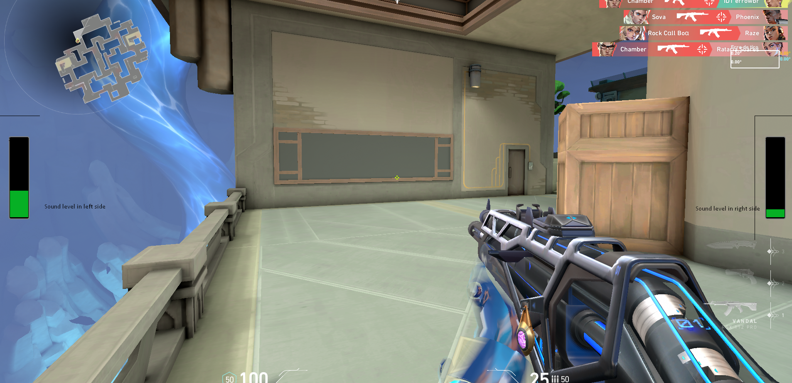

# Game sound for all
Project to provide extra accessibility for games, offering visual information for people with hearing conditions

Install python 3.8.2 or superior. Install pip to manage packages and install
extra packages 

#pip install PyQt5 sounddevice

OBS Studio

Virtual Cable Audio

Create new audio source for specific game our application and set the 
option monitor and forward to virtual cable.

